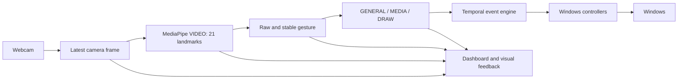

# SmartGestureOS

**Real-Time Hand Gesture Control System for Desktop Automation**

Computer Vision Based Touchless Human-Computer Interaction

[](https://python.org)
[](https://microsoft.com/windows)
[](LICENSE)

---

> **What is SmartGestureOS?**  
> SmartGestureOS is a Windows desktop utility that translates webcam hand gestures into desktop actions. It runs on top of Windows and adds touchless interaction alongside your mouse and keyboard. It is not a new operating system or a certified accessibility/medical solution.

The project explores whether a normal webcam can provide reliable, real-time
desktop control without specialized hardware. It combines computer vision,
geometric recognition, temporal input handling and Windows automation for a
B.Tech CSE (AI & ML) project, due 30 September 2026.

The [product specification](docs/PRODUCT_SPECIFICATION.md) is authoritative.
See the [subsystem audit and exact ten-step plan](docs/SPECIFICATION_AUDIT.md)
and [current implementation evidence](docs/PRODUCT_EXECUTION_2026-09-27.md).

---

## Features

**Release status (27 September 2026):** source and distribution validation is
in progress. Physical mouse/mode acceptance and clean-machine acceptance are pending;
see [release readiness](RELEASE_READINESS.md). The
[privacy policy](PRIVACY.md) explains MediaPipe's published metrics disclosure,
the observed native uploader activity, and the limits of local validation.

- **Three control modes** — GENERAL (mouse + OS), MEDIA, and DRAW
- **Real-time hand tracking** via MediaPipe Hand Landmarker (21 3D landmarks)
- **Animated RGB hand highlight** so a detected hand is easy to see in the camera view
- **14 built-in static gestures** — Pointing, Pinch, Victory, Rock On, Open Palm, Closed Fist, Thumb Up, Thumb Down, Two Fingers, Three Fingers, Four Fingers, Middle Finger, Call Me, and Crossed Fingers. Pinch hold/double-click are temporal actions.
- **Temporal event engine** — single/double click, drag, and scroll are temporal events, not static poses
- **Custom gesture training** — record and match your own gestures (nearest-sample matching)
- **Automatic camera recovery** — reconnects if webcam is unplugged
- **Hand-loss safety** — mouse is released immediately if hand disappears mid-drag
- **Async TTS feedback** — bounded queue, duplicate suppression
- **Professional CustomTkinter dashboard** — mode, gesture, confidence, CPU, RAM, latency

---

## Requirements

| Component | Requirement |
|-----------|------------|
| OS | Windows 10 or Windows 11 (x64) |
| Python | Only for source development: 3.11.x (validated: 3.11.9). Packaged users do not need it. |
| Webcam | USB or integrated; 640×480 or higher recommended |
| RAM | ≥ 4 GB recommended |
| GPU | Not required |

---

## Installation (from source)

```bash
# Clone
git clone https://github.com/Sarvagyabirla/SmartGestureOS.git
cd SmartGestureOS

# Create virtual environment
py -3.11 -m venv .venv
.venv\Scripts\activate

# Install dependencies
pip install -r requirements.txt
pip install -r requirements-dev.txt

# Run
python main.py
```

For installed users, the intended path is the product website → GitHub Release
→ `SmartGestureOS-Setup-v0.9.0.exe` → Start Menu. A public validated release is
not available yet; do not treat source archives as Windows installers.

---

## Usage

Launch the application:

```bash
python main.py
```

### Simple Workflow

1. **Launch SmartGestureOS** (`python main.py` or Start Menu).
2. **Place one hand in webcam view** (~30–60 cm away in normal lighting).
3. **Press Resume** (or press **Ctrl+Alt+G**).
4. **Lower/remove hand briefly** to re-arm the neutral state.
5. **Point to move**: Extend your index finger to glide the cursor fluently.
6. **Pinch to click**: Briefly bring thumb and index tips together to single-click.
7. **Pinch & hold to drag**: Keep thumb and index pinched to drag items; release to drop.
8. **Two Fingers to scroll**: Extend index and middle fingers together and move vertically.
9. **Emergency Pause**: Press **Ctrl+Alt+G** at any moment to pause instantly.

The app starts in **GENERAL** mode. Use the **Call Me** gesture (Thumb + Pinky) or the mode chips to cycle through:

```
GENERAL (Mouse & OS) → MEDIA (Volume & Playback) → DRAW (Touchless Canvas)
```

Refer to [GESTURES.md](GESTURES.md) for the complete gesture reference.

To inspect tracking safely without activating desktop actions, use **Settings → Advanced → Open Gesture Test**, or launch with `python main.py --start-paused`.

### Running in the background

Once Resume is armed you do **not** need the dashboard window open. Press
**Run in Background** (or close the window with *minimize to tray on close*
enabled) and the dashboard disappears while gesture control continues
normally.

| Action | How |
|---|---|
| Hide the dashboard | **Run in Background** button, or the window's X button |
| Pause / Resume automation | **Ctrl+Alt+G** (works while hidden) |
| Restore the dashboard | **Ctrl+Alt+Shift+G**, or the tray icon, or the taskbar button |
| Show current status | Tray icon → **Show Status** |
| Exit | Tray icon → **Exit**, or the window's X with *minimize to tray on close* disabled |

Background mode is strictly cheaper than the visible dashboard: the camera,
MediaPipe, classifier, pointer and event engine keep running, while preview
rendering, canvas compositing and landmark drawing stop completely. On the
development machine this is a measured **22 % lower CPU and zero preview
renders** versus the visible dashboard — see
[docs/UI_FREEZE_ROOT_CAUSE.md](docs/UI_FREEZE_ROOT_CAUSE.md).

The two hotkeys are deliberately separate and are never overloaded:
**Ctrl+Alt+G is the emergency stop**, and it stays reachable when no window
is visible.

---

## Tech Stack

| Layer | Technology | Why it is here |
|---|---|---|
| Language | **Python 3.11** (validated on 3.11.9) | Desktop runtime for the whole product |
| Computer vision | **OpenCV** (`opencv-contrib-python`) | Webcam capture, BGR↔RGB, resize, overlay drawing |
| Hand tracking | **MediaPipe Hand Landmarker 0.10.x** | 21 landmarks from a single RGB frame; the only ML model in the pipeline |
| Numerics | **NumPy** | Landmark geometry, filter math, canvas pixel buffers |
| Desktop UI | **CustomTkinter** on **Tkinter** | Dark-theme dashboard, buttons, canvas preview |
| Imaging | **Pillow** (`ImageTk`, `ImageGrab`) | PhotoImage conversion and full-screen screenshots |
| Keyboard hooks | **keyboard** | Global hotkeys (Pause/Resume, restore dashboard) |
| Windows API | **ctypes** / Win32 | `SetCursorPos`, `mouse_event`, `GetDoubleClickTime`, DXVA2 brightness |
| Audio | **pycaw** + **comtypes** | System volume up/down and mute over Core Audio |
| Brightness | **screen-brightness-control** + DXVA2 via ctypes | Laptop panels and external displays |
| Speech | **pyttsx3** | Asynchronous spoken feedback; never on the pointer path |
| Metrics | **psutil** | CPU and RAM for the dashboard |
| Tray icon | **pystray** | System-tray menu for Background Control Mode |
| Paths | **platformdirs** | User-writable data under `%LOCALAPPDATA%` |
| Packaging | **PyInstaller** (ONEDIR, `console=False`) | Self-contained `SmartGestureOS.exe`, no Python needed |
| Installer | **Inno Setup 6** | `SmartGestureOS-Setup-v0.9.0.exe` |
| Build/CI | **PowerShell** + **GitHub Actions** | Build, test, installer and release pipelines |
| Website | **HTML / CSS / JavaScript** on **GitHub Pages** | Static project site, no backend |

### Database and storage

**Database: none required.**

SmartGestureOS is a single-user, offline Windows desktop application. There is
no server, no multi-user account system, no relational data and no cloud
sync, so a SQL/NoSQL database would add a dependency and a failure mode with
no benefit. Persistence is deliberately local-first, plain files and JSON:

| Path (under `%LOCALAPPDATA%\SmartGestureOS`) | Contents |
|---|---|
| `profiles\` | Gesture profiles and the active-profile pointer |
| `custom_gestures\` | User-trained gesture templates |
| `screenshots\` | Saved screenshots (PNG) |
| `drawings\` | Saved canvas drawings (PNG) |
| `logs\` | Rotating application log |
| `benchmarks\` | Local performance measurements |

Read-only resources (`models\`, `config\`) ship inside the application and
are never written to — important because the program installs under
`Program Files`, which is read-only for normal users.

---

## Performance

These are **targets**, not guaranteed values. Actual performance depends on
hardware, lighting and camera driver.

| Metric | Target | Measured (dev machine) |
|---|---|---|
| Camera capture | ~30 fps where hardware allows | **14.7 fps** (USB webcam limit) |
| Detector / inference | as close to camera rate as practical | **14.5 fps** (tracks camera, not the bottleneck) |
| Preview (dashboard visible) | 20–30 fps | **~9 fps** with 30 fps UI tick budget |
| Preview (background mode) | disabled | **0 renders** (439 suppressed) |
| Pointer | close to detector rate | tracks detector |
| Inference latency | < 100 ms typical | **p50 57 ms / p95 66 ms** |
| Tk event-loop delay | no multi-hundred-ms stalls | **p50 0.49 ms / p95 1.08 ms** |
| RAM | stable over soak | **295 → 299 MB** (30 s) |
| CPU (visible / background) | < 2 cores | **238 % / 185 %** |

The detector is *not* inference-bound: a single MediaPipe VIDEO call measures
~15 ms on this machine, so the ~14.5 fps detector rate is set by the camera's
own 14.7 fps delivery, and the pipeline is keeping up with it.

### Diagnosing performance yourself

```powershell
# Tk cost breakdown, visible vs hidden (no camera needed)
.\.venv\Scripts\python.exe scripts\diagnose_ui_freeze.py --seconds 6

# Full live pipeline with a real webcam, visible vs background
.\.venv\Scripts\python.exe scripts\diagnose_runtime.py --seconds 30

# Pointer path latency over a still hand image
.\.venv\Scripts\python.exe scripts\measure_pointer_pipeline.py
```

## Gesture Modes

### GENERAL Mode
Full mouse control, OS shortcuts, volume, brightness, and discrete actions.

### MEDIA Mode
Control music playback: Play/Pause, Next Track, Previous Track, Mute.

### DRAW Mode
Draw on a canvas overlay. Undo, redo, color cycle, eraser, save drawing.

> **Note:** Draw mode draws on an in-app canvas overlay displayed in the SmartGestureOS window. It does not draw over arbitrary Windows applications.

---

## Running Tests

```bash
python -m pytest -q tests/
```

All automated tests should pass. Tests use mocks — no physical webcam or mouse required.

---

## Architecture and Project Structure



Camera capture and inference run on workers; Tk presentation stays on its UI
thread. Frames are processed locally in memory. The preview shows measured
camera/detector rates, inference latency and input age separately. Missing audio,
unsupported brightness or an absent target application should produce a local
error without crashing tracking.

```text
SmartGestureOS/
├── main.py                    # Entry point, thread orchestrator
├── config.py                  # Settings loader
├── src/
│   ├── camera.py              # Threaded camera capture with reconnect
│   ├── gesture_detector.py    # Synchronous MediaPipe VIDEO inference
│   ├── gesture_classifier.py  # Geometric gesture recognition
│   ├── event_engine.py        # Temporal state machine (click/drag/scroll)
│   ├── gesture_mapper.py      # Mode-aware action routing
│   ├── mouse_controller.py    # Cursor movement + EventEngine bridge
│   ├── virtual_mouse.py       # Win32 API mouse input
│   ├── drawing.py             # Canvas with undo/redo/save
│   ├── ui.py                  # CustomTkinter dashboard
│   └── *_controller.py        # Volume, brightness, media, desktop, etc.
├── models/
│   └── hand_landmarker.task   # MediaPipe model (bundled)
├── config/
│   └── defaults.json          # Default settings
├── packaging/
│   └── windows/
│       ├── SmartGesture.spec  # PyInstaller ONEDIR spec
│       └── SmartGestureOS.iss # Inno Setup installer script
├── scripts/
│   └── build_windows.ps1      # Build automation
├── tests/                     # Pytest test suite (mocked)
├── GESTURES.md                # Complete gesture reference
└── requirements.txt
```

---

## Packaging

Build a Windows installer:

```powershell
# Step 1: Build ONEDIR executable
.\scripts\build_windows.ps1

# Step 2: Create installer (requires Inno Setup 6+ and ISCC.exe on PATH)
.\scripts\build_installer.ps1
```

Output: `dist\release\SmartGestureOS-Setup-v0.9.0.exe`

The ONEDIR executable supports `--self-check` for native model inference and
`--ui-self-check` for real dashboard/preview/auxiliary-window initialization.
Neither probe opens a webcam or proves gesture accuracy. The installer helper
also writes `SHA256SUMS.txt`. Build helpers accept `-PythonExe` for an explicit
Python 3.11 interpreter, and the installer accepts `-IsccPath`.

To build MSIX, first create the ONEDIR build, then supply exact Partner Center
identity values in the single `packaging/windows/msix/AppxManifest.xml`. Real
PNG assets are included in its `Assets` folder. Run `scripts/build_msix.ps1`;
it validates inputs and writes to `dist/release`. Microsoft Store status is
**NOT STARTED** until a valid identity/package and account submission exist.

---

## Team

Developed by **Sarvagya Birla**, **Uday Dangi**, and **Shantanu Yadav**

Under the guidance of **Ms. Ankita Dubey**

---

## Troubleshooting

| Issue | Solution |
|-------|----------|
| No camera feed | Close other camera apps; check Windows permission; select camera 0, 1 or 2 in Settings, save and restart |
| Volume not working | `pycaw` requires Windows with an active audio device |
| Brightness not working | External monitors use DXVA2; laptop panels use `screen-brightness-control` |
| `ModuleNotFoundError` | Ensure `.venv` is activated and `pip install -r requirements.txt` completed |
| Gestures not recognized | Ensure good lighting; keep hand within frame |

---

## License

MIT License — see [LICENSE](LICENSE)
